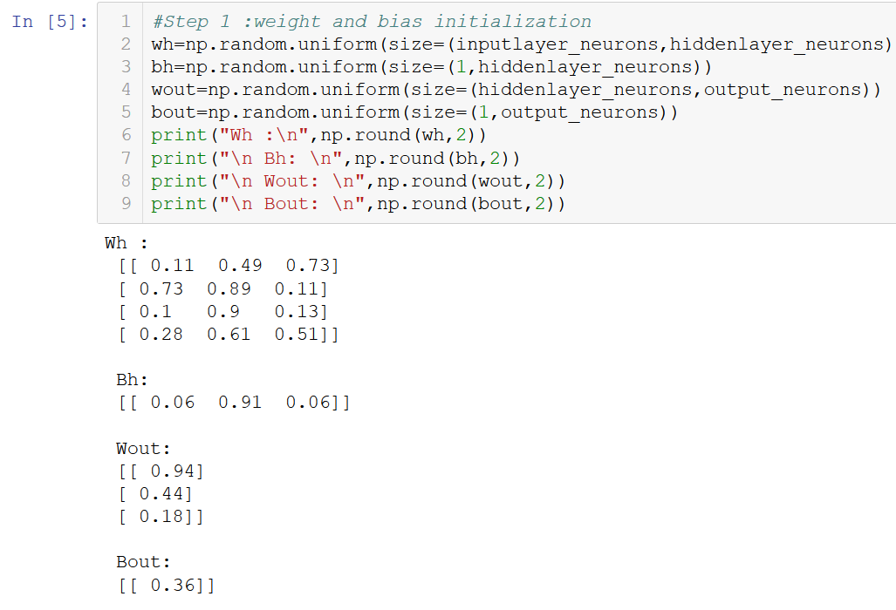

# Assignment 2A
Github link - 

# Assignment 2B

**Step 0:** Read input and output 


|  | X |  |  | wh | wh | wh | bh | bh | bh | hidden | layer | input | hidden | layer | activations | wout | bout | output | y | E | 
|---|---|---|---|----|----|----|----|----|----|--------|-------|-------|--------|-------|-------------|------|------|--------|---|---| 
| 1 | 0 | 1 | 0 |    |    |    |    |    |    |        |       |       |        |       |             |      |      |        | 1 |   | 
| 1 | 0 | 1 | 1 |    |    |    |    |    |    |        |       |       |        |       |             |      |      |        | 1 |   | 
| 0 | 1 | 0 | 1 |    |    |    |    |    |    |        |       |       |        |       |             |      |      |        | 0 |   | 

**Step 1:** Initialize weights and biases with random values (There are methods to initialize weights and biases but for now initialize with random values)



|  |  | X |  | wh   | wh   | wh   | bh   | bh   | bh   | hidden | layer | input | hidden | layer | activations | wout | bout | output | y | E | 
|---|---|---|---|------|------|------|------|------|------|--------|-------|-------|--------|-------|-------------|------|------|--------|---|---| 
| 1 | 0 | 1 | 0 | 0.11 | 0.49 | 0.73 | 0.06 | 0.91 | 0.06 |        |       |       |        |       |             | 0.94 | 0.36 |        | 1 |   | 
| 1 | 0 | 1 | 1 | 0.73 | 0.89 | 0.11 |      |      |      |        |       |       |        |       |             | 0.44 |      |        | 1 |   | 
| 0 | 1 | 0 | 1 | 0.1  | 0.9  | 0.13 |      |      |      |        |       |       |        |       |             | 0.18 |      |        | 0 |   | 
|   |   |   |   | 0.28 | 0.61 | 0.51 |      |      |      |        |       |       |        |       |             |      |      |        |   |   | 

**Step 2:** Calculate hidden layer input:
```python
hidden_layer_input=(np.dot(X,wh))+bh
```


| X | X | X | X | wh   | wh   | wh   | bh   | bh   | bh   | hidden | layer | input | hidden | layer | activations | wout | bout | output | y | E | 
|---|---|---|---|------|------|------|------|------|------|--------|-------|-------|--------|-------|-------------|------|------|--------|---|---| 
| 1 | 0 | 1 | 0 | 0.11 | 0.49 | 0.73 | 0.06 | 0.91 | 0.06 | 0.57   | 0.91  | 0.72  |        |       |             | 0.94 | 0.36 |        | 1 |   | 
| 1 | 0 | 1 | 1 | 0.73 | 0.89 | 0.11 |      |      |      | 0.63   | 0.95  | 0.81  |        |       |             | 0.44 |      |        | 1 |   | 
| 0 | 1 | 0 | 1 | 0.1  | 0.9  | 0.13 |      |      |      | 0.75   | 0.92  | 0.66  |        |       |             | 0.18 |      |        | 0 |   | 
|   |   |   |   | 0.28 | 0.61 | 0.51 |      |      |      |        |       |       |        |       |             |      |      |        |   |   | 

**Step 3:** Perform non-linear transformation on hidden linear input
```python
hiddenlayer_activations = sigmoid(hidden_layer_input)
```


| X | X | X | X | wh   | wh   | wh   | bh   | bh   | bh   | hidden | layer | input | hidden | layer | activations | wout | bout | output | y | E | 
|---|---|---|---|------|------|------|------|------|------|--------|-------|-------|--------|-------|-------------|------|------|--------|---|---| 
| 1 | 0 | 1 | 0 | 0.11 | 0.49 | 0.73 | 0.06 | 0.91 | 0.06 | 0.57   | 0.91  | 0.72  | 0.57   | 0.91  | 0.72        | 0.94 | 0.36 |        | 1 |   | 
| 1 | 0 | 1 | 1 | 0.73 | 0.89 | 0.11 |      |      |      | 0.63   | 0.95  | 0.81  | 0.63   | 0.95  | 0.81        | 0.44 |      |        | 1 |   | 
| 0 | 1 | 0 | 1 | 0.1  | 0.9  | 0.13 |      |      |      | 0.75   | 0.92  | 0.66  | 0.75   | 0.92  | 0.66        | 0.18 |      |        | 0 |   | 
|   |   |   |   | 0.28 | 0.61 | 0.51 |      |      |      |        |       |       |        |       |             |      |      |        |   |   | 

**Step 4:** Perform linear and non-linear transformation of hidden layer activation at output layer
```python
output_layer_input1=np.dot(hiddenlayer_activations,wout)
output_layer_input= output_layer_input1+ bout
output = sigmoid(output_layer_input)
```


| X | X | X | X | wh   | wh   | wh   | bh   | bh   | bh   | hidden | layer | input | hidden | layer | activations | wout | bout | output | y | E | 
|---|---|---|---|------|------|------|------|------|------|--------|-------|-------|--------|-------|-------------|------|------|--------|---|---| 
| 1 | 0 | 1 | 0 | 0.11 | 0.49 | 0.73 | 0.06 | 0.91 | 0.06 | 0.57   | 0.91  | 0.72  | 0.57   | 0.91  | 0.72        | 0.94 | 0.36 |        | 1 |   | 
| 1 | 0 | 1 | 1 | 0.73 | 0.89 | 0.11 |      |      |      | 0.63   | 0.95  | 0.81  | 0.63   | 0.95  | 0.81        | 0.44 |      |        | 1 |   | 
| 0 | 1 | 0 | 1 | 0.1  | 0.9  | 0.13 |      |      |      | 0.75   | 0.92  | 0.66  | 0.75   | 0.92  | 0.66        | 0.18 |      |        | 0 |   | 
|   |   |   |   | 0.28 | 0.61 | 0.51 |      |      |      |        |       |       |        |       |             |      |      |        |   |   | 


**Step 5:** Calculate gradient of Error(E) at output layer
```python
E = y-output
```


| X | X | X | X | wh   | wh   | wh   | bh   | bh   | bh   | hidden | layer | input | hidden | layer | activations | wout | bout | output | y | E       | 
|---|---|---|---|------|------|------|------|------|------|--------|-------|-------|--------|-------|-------------|------|------|--------|---|---------| 
| 1 | 0 | 1 | 0 | 0.11 | 0.49 | 0.73 | 0.06 | 0.91 | 0.06 | 0.57   | 0.91  | 0.72  | 0.57   | 0.91  | 0.72        | 0.94 | 0.36 | 0.8    | 1 | 0.1954  | 
| 1 | 0 | 1 | 1 | 0.73 | 0.89 | 0.11 |      |      |      | 0.63   | 0.95  | 0.81  | 0.63   | 0.95  | 0.81        | 0.44 |      | 0.82   | 1 | 0.1807  | 
| 0 | 1 | 0 | 1 | 0.1  | 0.9  | 0.13 |      |      |      | 0.75   | 0.92  | 0.66  | 0.75   | 0.92  | 0.66        | 0.18 |      | 0.83   | 0 | -0.8288 | 
|   |   |   |   | 0.28 | 0.61 | 0.51 |      |      |      |        |       |       |        |       |             |      |      |        |   |         | 

**Step 6:** Compute slope at output and hidden layer
```python
slope_output_layer = der_sigmoid(output)
slope_hidden_layer = der_sigmoid(hiddenlayer_activations)
```


| X | X | X | X | wh   | wh   | wh   | bh   | bh   | bh   | hidden | layer | input | hidden | layer | activations | wout | bout | output | y | E       | Slope- | hidden- | layer | Slope Output | 
|---|---|---|---|------|------|------|------|------|------|--------|-------|-------|--------|-------|-------------|------|------|--------|---|---------|--------|---------|-------|--------------| 
| 1 | 0 | 1 | 0 | 0.11 | 0.49 | 0.73 | 0.06 | 0.91 | 0.06 | 0.57   | 0.91  | 0.72  | 0.57   | 0.91  | 0.72        | 0.94 | 0.36 | 0.8    | 1 | 0.1954  | 0.25   | 0.08    | 0.2   | 0.16         | 
| 1 | 0 | 1 | 1 | 0.73 | 0.89 | 0.11 |      |      |      | 0.63   | 0.95  | 0.81  | 0.63   | 0.95  | 0.81        | 0.44 |      | 0.82   | 1 | 0.1807  | 0.23   | 0.05    | 0.16  | 0.15         | 
| 0 | 1 | 0 | 1 | 0.1  | 0.9  | 0.13 |      |      |      | 0.75   | 0.92  | 0.66  | 0.75   | 0.92  | 0.66        | 0.18 |      | 0.83   | 0 | -0.8288 | 0.19   | 0.08    | 0.22  | 0.14         | 
|   |   |   |   | 0.28 | 0.61 | 0.51 |      |      |      |        |       |       |        |       |             |      |      |        |   |         |        |         |       |              | 

**Step 7:** Compute delta at output layer
```python
d_output = E * slope_output_layer
```


| X | X | X | X | wh   | wh   | wh   | bh   | bh   | bh   | hidden | layer | input | hidden | layer | activations | wout | bout | output | y | E       | Slope- | hidden- | layer | Slope Output | delta output | 
|---|---|---|---|------|------|------|------|------|------|--------|-------|-------|--------|-------|-------------|------|------|--------|---|---------|--------|---------|-------|--------------|--------------| 
| 1 | 0 | 1 | 0 | 0.11 | 0.49 | 0.73 | 0.06 | 0.91 | 0.06 | 0.57   | 0.91  | 0.72  | 0.57   | 0.91  | 0.72        | 0.94 | 0.36 | 0.8    | 1 | 0.1954  | 0.25   | 0.08    | 0.2   | 0.16         | 0.03         | 
| 1 | 0 | 1 | 1 | 0.73 | 0.89 | 0.11 |      |      |      | 0.63   | 0.95  | 0.81  | 0.63   | 0.95  | 0.81        | 0.44 |      | 0.82   | 1 | 0.1807  | 0.23   | 0.05    | 0.16  | 0.15         | 0.03         | 
| 0 | 1 | 0 | 1 | 0.1  | 0.9  | 0.13 |      |      |      | 0.75   | 0.92  | 0.66  | 0.75   | 0.92  | 0.66        | 0.18 |      | 0.83   | 0 | -0.8288 | 0.19   | 0.08    | 0.22  | 0.14         | -0.12        | 
|   |   |   |   | 0.28 | 0.61 | 0.51 |      |      |      |        |       |       |        |       |             |      |      |        |   |         |        |         |       |              |              | 

**Step 8:** Calculate Error at hidden layer
```python
Error_at_hidden_layer = d_output.dot(wout.T)
```


| X | X | X | X | wh   | wh   | wh   | bh   | bh   | bh   | hidden | layer | input | hidden | layer | activations | wout | bout | output | y | E       | Slope- | hidden- | layer | Slope Output | delta output | Error   | Hidden  | layer   | 
|---|---|---|---|------|------|------|------|------|------|--------|-------|-------|--------|-------|-------------|------|------|--------|---|---------|--------|---------|-------|--------------|--------------|---------|---------|---------| 
| 1 | 0 | 1 | 0 | 0.11 | 0.49 | 0.73 | 0.06 | 0.91 | 0.06 | 0.57   | 0.91  | 0.72  | 0.57   | 0.91  | 0.72        | 0.94 | 0.36 | 0.8    | 1 | 0.1954  | 0.25   | 0.08    | 0.2   | 0.16         | 0.03         | 0.0289  | 0.0134  | 0.0054  | 
| 1 | 0 | 1 | 1 | 0.73 | 0.89 | 0.11 |      |      |      | 0.63   | 0.95  | 0.81  | 0.63   | 0.95  | 0.81        | 0.44 |      | 0.82   | 1 | 0.1807  | 0.23   | 0.05    | 0.16  | 0.15         | 0.03         | 0.0252  | 0.0117  | 0.0117  | 
| 0 | 1 | 0 | 1 | 0.1  | 0.9  | 0.13 |      |      |      | 0.75   | 0.92  | 0.66  | 0.75   | 0.92  | 0.66        | 0.18 |      | 0.83   | 0 | -0.8288 | 0.19   | 0.08    | 0.22  | 0.14         | -0.12        | -0.1108 | -0.5313 | -0.0513 | 
|   |   |   |   | 0.28 | 0.61 | 0.51 |      |      |      |        |       |       |        |       |             |      |      |        |   |         |        |         |       |              |              |         |         |         | 

**Step 9:** Compute delta at hidden layer

```python
d_hiddenlayer = Error_at_hidden_layer * slope_hidden_layer
```


| X | X | X | X | wh   | wh   | wh   | bh   | bh   | bh   | hidden | layer | input | hidden | layer | activations | wout | bout | output | y | E       | Slope- | hidden- | layer | Slope Output | delta output | Error   | Hidden  | layer   | delta  | hidden  | layer   | 
|---|---|---|---|------|------|------|------|------|------|--------|-------|-------|--------|-------|-------------|------|------|--------|---|---------|--------|---------|-------|--------------|--------------|---------|---------|---------|--------|---------|---------| 
| 1 | 0 | 1 | 0 | 0.11 | 0.49 | 0.73 | 0.06 | 0.91 | 0.06 | 0.57   | 0.91  | 0.72  | 0.57   | 0.91  | 0.72        | 0.94 | 0.36 | 0.8    | 1 | 0.1954  | 0.25   | 0.08    | 0.2   | 0.16         | 0.03         | 0.0289  | 0.0134  | 0.0054  | 0.0071 | 0.0011  | 0.0011  | 
| 1 | 0 | 1 | 1 | 0.73 | 0.89 | 0.11 |      |      |      | 0.63   | 0.95  | 0.81  | 0.63   | 0.95  | 0.81        | 0.44 |      | 0.82   | 1 | 0.1807  | 0.23   | 0.05    | 0.16  | 0.15         | 0.03         | 0.0252  | 0.0117  | 0.0117  | 0.0059 | 0.0006  | 0.0007  | 
| 0 | 1 | 0 | 1 | 0.1  | 0.9  | 0.13 |      |      |      | 0.75   | 0.92  | 0.66  | 0.75   | 0.92  | 0.66        | 0.18 |      | 0.83   | 0 | -0.8288 | 0.19   | 0.08    | 0.22  | 0.14         | -0.12        | -0.1108 | -0.5313 | -0.0513 | -0.021 | -0.0039 | -0.0046 | 
|   |   |   |   | 0.28 | 0.61 | 0.51 |      |      |      |        |       |       |        |       |             |      |      |        |   |         |        |         |       |              |              |         |         |         |        |         |         | 

**Step 10:** Update weight at both output and hidden layer

```python
wout += hiddenlayer_activations.T.dot(d_output) *lr
wh += X.T.dot(d_hiddenlayer) *lr
```


| X | X | X | X | wh   | wh   | wh   | bh   | bh   | bh   | hidden | layer | input | hidden | layer | activations | wout | bout | output | y | E       | Slope- | hidden- | layer | Slope Output | delta output | Error   | Hidden  | layer   | delta  | hidden  | layer   | 
|---|---|---|---|------|------|------|------|------|------|--------|-------|-------|--------|-------|-------------|------|------|--------|---|---------|--------|---------|-------|--------------|--------------|---------|---------|---------|--------|---------|---------| 
| 1 | 0 | 1 | 0 | 0.11 | 0.49 | 0.73 | 0.06 | 0.91 | 0.06 | 0.57   | 0.91  | 0.72  | 0.57   | 0.91  | 0.72        | 0.94 | 0.36 | 0.8    | 1 | 0.1954  | 0.25   | 0.08    | 0.2   | 0.16         | 0.03         | 0.0289  | 0.0134  | 0.0054  | 0.0071 | 0.0011  | 0.0011  | 
| 1 | 0 | 1 | 1 | 0.73 | 0.89 | 0.11 |      |      |      | 0.63   | 0.95  | 0.81  | 0.63   | 0.95  | 0.81        | 0.43 |      | 0.82   | 1 | 0.1807  | 0.23   | 0.05    | 0.16  | 0.15         | 0.03         | 0.0252  | 0.0117  | 0.0117  | 0.0059 | 0.0006  | 0.0007  | 
| 0 | 1 | 0 | 1 | 0.1  | 0.9  | 0.13 |      |      |      | 0.75   | 0.92  | 0.66  | 0.75   | 0.92  | 0.66        | 0.17 |      | 0.83   | 0 | -0.8288 | 0.19   | 0.08    | 0.22  | 0.14         | -0.12        | -0.1108 | -0.5313 | -0.0513 | -0.021 | -0.0039 | -0.0046 | 
|   |   |   |   | 0.27 | 0.61 | 0.51 |      |      |      |        |       |       |        |       |             |      |      |        |   |         |        |         |       |              |              |         |         |         |        |         |         | 

**Step 11:** Update biases at both output and hidden layer

```python
bout += np.sum(d_output, axis=0,keepdims=True) *lr
bh += np.sum(d_hiddenlayer, axis=0,keepdims=True) *lr
```


| X | X | X | X | wh   | wh   | wh   | bh   | bh   | bh   | hidden | layer | input | hidden | layer | activations | wout | bout | output | y | E       | Slope- | hidden- | layer | Slope Output | delta output | Error   | Hidden  | layer   | delta  | hidden  | layer   | 
|---|---|---|---|------|------|------|------|------|------|--------|-------|-------|--------|-------|-------------|------|------|--------|---|---------|--------|---------|-------|--------------|--------------|---------|---------|---------|--------|---------|---------| 
| 1 | 0 | 1 | 0 | 0.11 | 0.49 | 0.73 | 0.06 | 0.91 | 0.06 | 0.57   | 0.91  | 0.72  | 0.57   | 0.91  | 0.72        | 0.94 | 0.35 | 0.8    | 1 | 0.1954  | 0.25   | 0.08    | 0.2   | 0.16         | 0.03         | 0.0289  | 0.0134  | 0.0054  | 0.0071 | 0.0011  | 0.0011  | 
| 1 | 0 | 1 | 1 | 0.73 | 0.89 | 0.11 |      |      |      | 0.63   | 0.95  | 0.81  | 0.63   | 0.95  | 0.81        | 0.43 |      | 0.82   | 1 | 0.1807  | 0.23   | 0.05    | 0.16  | 0.15         | 0.03         | 0.0252  | 0.0117  | 0.0117  | 0.0059 | 0.0006  | 0.0007  | 
| 0 | 1 | 0 | 1 | 0.1  | 0.9  | 0.13 |      |      |      | 0.75   | 0.92  | 0.66  | 0.75   | 0.92  | 0.66        | 0.17 |      | 0.83   | 0 | -0.8288 | 0.19   | 0.08    | 0.22  | 0.14         | -0.12        | -0.1108 | -0.5313 | -0.0513 | -0.021 | -0.0039 | -0.0046 | 
|   |   |   |   | 0.27 | 0.61 | 0.51 |      |      |      |        |       |       |        |       |             |      |      |        |   |         |        |         |       |              |              |         |         |         |        |         |         | 
